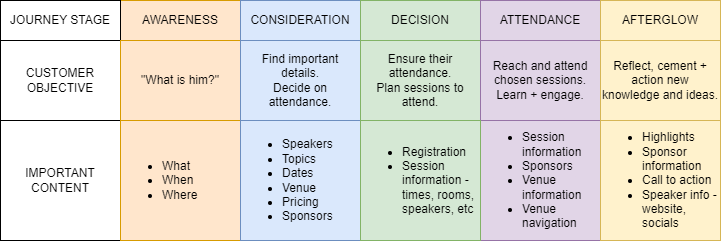

# Content Modeling

## Core Content + Relationships

*Review the project requirements and make a “model inventory.” What types of content are necessary for this project? How do they relate to each other?*

### Primitive Models

#### Speakers
- Name
- Image
- Bio
- Website, social media, etc

#### Presentations
- Name
- Topic
- Content (outline, key points)

#### Venues
- City
- Website

#### Rooms
- Venue

### Associative Models

#### Session
- Presentation
- Venue
- Room
- Speaker
- Time

#### Schedule
- Venue
- Sessions

Below diagram uses the ERD format to approximate the relationships between content.

This should not be viewed as an exhaustive list of all content required for the project. Conference branding, sponsor information, highlights, and many other content models may be required. This is primarily to illustrate and plan the critical content for the conference.

*What are the business goals for the project?*

- Promote upcoming conference
- Provide information about conference to potential attendees
- Promote sponsors and suppliers
- Easily publish, edit or maintain information
  - Separate content management and delivery/front-end

*What are the customer goals, e.g., how will the end-users use the content?*

- Quickly and easily find relevant information about the conference:
  - Speakers
  - Venues
  - Dates + times
  - Topics
- Register to attend
  - Currently unnecessary, but this should be explained
  - May change in the future

*What is the customer journey? How could you surface the correct content during the right part of the customer journey?*

A customer journey represents the arc of their experience with a product, organisation, etc. This begins with first exposure, and continues with every interaction.

Specifically to this project, stages I am interested in considering include:
**Awareness:** When a potential customer becomes aware of the conference. This could be through advertising, word of mouth, social media, and other means. Important content will naturally include the name/logo/branding for the conference. It may also be helpful to consider high-level information such as the industry/niche of the conference, locations, and time period, as this could help make sure that the correct audience is reached.

**Consideration:** In this stage, a customer is aware of the conference, and considering whether to attend. Important content will cover the details and information needed to make this decision. Pricing (free), session and speaker information, location, etc., will need to be surfaced at this stage; preferably in a form that is easy to find and consume. Also some sponsor information may be helpful as a form of social proof, increasing credibility.

**Decision:** The customer has decided to attend. It has been established that no registration is necessary, but it is important to consider this stage as this decision may be changed. It is also important to make it obvious to the customer that registration is currently unnecessary. The next most important content at this point is likely to be detailed session/schedule information, so the customer can decide which sessions they wish to attend.

**Attendance:** The customer is at the conference. Again, session information is important, so that customers know correct times + rooms for their sessions. Any information about navigating the venue to find rooms should be surfaced in this stage. Also at this stage more information and branding regarding sponsors (raising awareness) and venue providers (this is likely to be the peak of customer interest in the venue - when they're present in it).

**Afterglow:** This is a tongue-in-cheek description for the post-attendance stage. The conference is concluded, or at least the sessions the customer attended. Relevant content in this stage may include sessions highlights such as videos, articles, or social media posts the customer may wish to view or share. More detailed speaker information could be helpful - customers may wish to follow speakers on online channels or learn about their other work, and this is a good opportunity to promote our speakers. Further content about sponsors may be relevant here as well. And any "call to action" content is relevant here - perhaps a video, PDF or e-book to download going over key takeaways from the conference? Information about other upcoming events, products and services that might be promoted, etc. This stage is more focused on capturing the momentum of the customer's action (attending) and growing that into further interactions for ourselves and our sponsors.

Taxonomy will be a useful tool to help surface the correct information - a Taxonomy Group for Customer Journey Stage with the relevant options would be a simple implementation of this.

